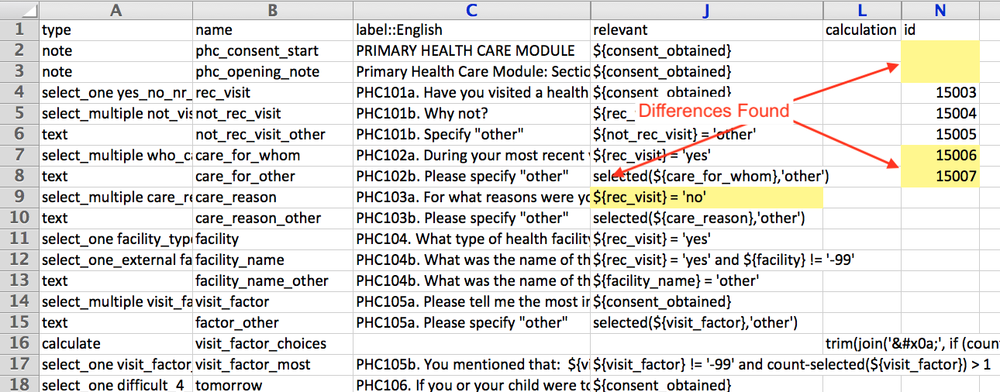
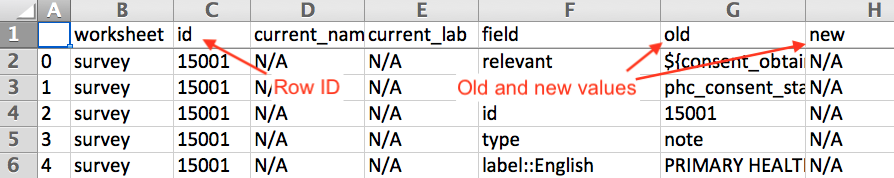

# PMIX: Questionnaire Language Utilities

A mixed bag of PMA2020 utilities. There are several functionalities all based
on working with spreadsheets. The main features are the following:

* [Analytics](#analytics)
* [Borrow](#borrow)
* [Cascade](#cascade)
* [Numbering](#numbering)
* [PPP](#ppp)
* [Workbook](#workbook)
* [XlsDiff](#xlsdiff)
* [Viffer](#viffer)

Formerly [`qlang`](https://github.com/jkpr/qlang), this package has been renamed and expanded to provide new
functionality and new command-line tools. The command line tools are described after installation.

This version requires Python 3 or later. Python 2 is not supported.


## Installation

Run:

```
python3 -m pip install https://github.com/jkpr/pmix/zipball/master
```

## Analytics

Usage

```
python3 -m pmix.analytics FILE1 [FILE2 ...]
```

creates a JSON file describing the prompts and fields for analytics.

## Borrow
The purpose of the Pmix *Borrow* module use to assist with translation
management of ODK forms. It is especially useful for merging translations from
one file into another.

#### Command Line Usage
This module is called with

```
python3 -m pmix.borrow
```

and it does two things. Without the `-m` argument, it simply creates a
translation dictionary. The source string is in the first column, and the
target languages are in the subsequent columns. With the `-m` argument,
it creates a translation dictionary and then merges those translations into
the file specified by `-m`.

##### Examples

1) Without `-m`,

```
python3 -m pmix.borrow FILE1 [FILE2 ...]
```

creates a translation dictionary from `FILE1 [FILE2 ...]`.

2) With `-m`,

```
python3 -m pmix.borrow -m TARGET FILE1 [FILE2 ...]
```

creates a translation dictionary from `FILE1 [FILE2 ...]` and then merges into `TARGET`.

In both examples, a default output filename is used, but one can be specified with the `-o` argument.

#### The Input File
The input file can be 1 of 2 kinds:
1. A standard ODK file.
2. A raw translations file.

A raw translations file has the following form, using English and French as
examples:

| text::English | text::Français | ... | text::<language *n*\> |
| --- | --- | --- | --- |
| Hello! | Bonjour! | ... | <"Hello!" in language *n*\> |

#### The Output File
A resultant file with merged translations has the following possible highlighting:

 *Orange/Peach* if the source and the translation are the same.  
 *Blue* if the new translation changes the old translation.  
 *Green* if the translation is not found in the TranslationDict, but there is a pre-existing translation.  
 *Red* if translation is not found and there is no pre-existing translation.  
 *No highlight* if the translation is the same as the pre-existing translation.

## Cascade

Usage

```
python3 -m pmix.cascade FILE
```

creates a new Excel spreadsheet after converting geographic identifiers from wide format to tall format.

## Numbering

Use the numbering mini-language and create question numbers for an ODK survey.

```
python3 -m pmix.numbering FILE
```

The program then looks for a column entitled "N" in the "survey" worksheet. It creates numbers based off of the
directives there and adds them to label columns.

## PPP
#### About PPP
PPP is a tool that converts ODK XlsForm specification .xlsx Excel files to more human-readable, printable formats, commonly called "paper questionnaires".

Officially, PPP stands for "Pretty PDF Printer", but other formats are supported (see: the `--format` option described in the "CLI How-to").

#### PPP Web Application
PPP also exists on the web!
- Convert XlsForms online: http://ppp.pma2020.org
- GitHub: https://github.com/pma-2020/ppp-web

#### CLI How-to
##### Positional Arguments
| Argument | Description |
|:---------|:------------|
| xlsxfile |  Path to source XLSForm. |

##### Options
| Short Flag | Long Flag | Description |
|:-----------|:----------|:------------|
| -h | --help           | Show this help message and exit.
| -d | --debug          | Turns on debug mode. Currently only works for 'html' format. Only feature of debug mode currently is that it prints a stringified JSON representation of survey to the JavaScript console.
| -H | --highlight      | Turns on highlighting of various portions of survey components. Useful to assess positioning.
| -o | --outpath | Path to write output. If this argument is not supplied, then STDOUT is used. Option Usage: `-o OUPATH`.
| -l | --language | Language to write the paper version in. If not specified, the 'default_language' in the 'settings' worksheet is used. If that is not specified and more than one language is in the XLSForm, the language that comes first alphabetically will be used. Option usage: `-l LANGUAGE`.
| -f | --format | File format. HTML and DOC are supported formats. PDF is not supported, but one can easily convert a PPP .doc file into PDF via the use of *wkhtmltopdf* (https://wkhtmltopdf.org/). If this flag is not supplied, output is html by default. Option usage: `-f {html,doc}`.
| -i | --input-replacement | Adding this option will toggle replacement of visible choice options in input fields. Instead of the normal choice options, whatever has been placed in the 'ppp_input' field of the XlsForm will be used. This is normally to hide sensitive information.
| -e | --exclusion       | Adding this option will toggle exclusion of certain survey form components from the rendered form. This can be used to remove ODK-specific implementation elements from the form which are only useful for developers, and can also be used to wholly remove sensitive information without any replacement.
| -r | --hr-relevant     | Adding this option will toggle display of human readable 'relevant' text, rather than the syntax-heavy codified logic of the original XlsForm.
| -c | --hr-constraint   | Adding this option will toggle display of human readable 'constraint' text, rather than the syntax- heavy codified logic of the original XlsForm.
| -C | --no-constraint   | Adding this option will toggle removal of all constraints from the rendered form.
| -t | --text-replacements | Adding this option will toggle text replacements as shown in the 'text_replacements' worksheet of the XlsForm. The most common function of text replacement is to render more human readable variable names, but can also be used to remove sensitive information, or add brevity / clarity where needed.
| -p  | --preset | Select from a preset of bundled options. The 'developer' preset renders a form that is the most similar to the original XlsForm. The 'internal' preset is more human readable but is not stripped of sensitive information. The 'public' option is like the 'internal' option, only with sensitive information removed. Option usage: `-p {public,internal,developer,minimal}`.

##### Example Usage
> `python -m  ppp myXlsForm.xlsx`
> *Prints HTML converted XlsForm with default settings to the console*
  
> `python -m  ppp myXlsForm.xlsx -l Français -f doc -p minimal > myXlsForm.doc`
> *Converts an ODK Excel file to a MS Word-readable .doc file (is really HTML under the hood), with the preset of "minimal", and the language set to French*

> `python -m ppp myXlsForm1.xlsx myXlsForm2.xlsx -l Luganda Lusoga English -f doc pdf -p minimal full`
> *Saves a document for every combination of forms and options passed, in this case **2** input files \* **3** languages \* **2** file formats \* **2** detail formats, or **24** output files*

## Workbook

There following features are offered:

1. Convert a worksheet to CSV with UTF-8 encoding and UNIX-style newlines.

```
python3 -m pmix.workbook FILE -c SHEET
```

2. Remove all trailing and leading whitespace from all text cells

```
python3 -m pmix.workbook FILE -w
```

## XlsDiff
A utility for showing the differences between two Excel files.

```
python3 -m pmix.xlsdiff FILE1 FILE2 --excel
```

The above command creates a new Excel file, creating a new version of `FILE2` 
with highlighting to show differences.

 *Red* -- Rows and columns that are duplicate so are not compared  
 *Orange/Peach* -- Rows and columns that are in the marked up file (`FILE2`), but not in the other  
 *Light Yellow* -- Cells that are different between the the two files  
 *Green* -- Rows that are in a changed order  



##### Options
| Short Flag | Long Flag | Description |
|:-----------|:----------|:------------|
| -h | --help | Show this help message and exit. |
| -r | --reverse | Reverse the order of the base file and the new file for processing. |
| -s | --simple | Do a simple diff instead of the default ODK diff. |
| -e | --excel | Path to write Excel output. If flag is given with no argument then default out path is used. If flag is omitted, then write text output to STDOUT.|

## Viffer
Viffer is a tool that provides a tabulated report on the differences between two XlsForms. Viffer stands for "Version Diff'er".



This tool is currently under development under another fork of pmix. If interested in using it, please see: https://github.com/joeflack4/pmix/tree/feature_viffer#viffer

##### Example Usage
Generate a Viffer report.
`python -m  pmix.viffer old_form.xlsx new_form.xlsx`


## Bugs

Submit bug reports to James Pringle at jpringleBEAR@jhu.edu minus the bear.
