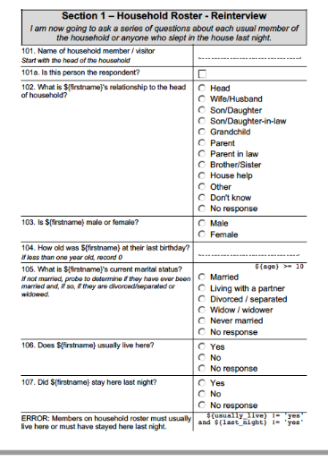

# PPP
## About
PPP is a project with the purpose of helping people convert XlsForm Excel files into more human-readable, printable formats, commonly called "paper questionnaires". Officially, PPP stands for "Pretty PDF Printer", but other formats are supported. The project consists of...

- A [web application](https://github.com/pma-2020/ppp)
- A [command line tool](https://github.com/pma-2020/ppp-web)

Both tools are open source and free to install. You can also use it online with no installation necessary, at http://ppp.pma2020.org.

#### Samples
- Source Excel file: [demo.xlsx](docs/demo.xlsx)
- Converted to PDF: [demo.pdf](docs/demo.pdf)
- Converted to DOC: [demo.doc](docs/demo.doc)
- Manually saved as DOCX from DOC: [demo.docx](docs/demo.docx)
- Converted to HTML: [demo.html](docs/demo.html)

**Example Screenshot**

## Documentation for end users
### Installation  
`pip install odk-ppp`

### CLI
#### Positional Arguments
| Argument | Description |
|:---------|:------------|
| xlsxfile |  Path to source XLSForm. |

#### Options
| Short Flag | Long Flag | Description |
|:-----------|:----------|:------------|
| -h | --help           | Show this help message and exit.
| -d | --debug          | Turns on debug mode. Currently only works for 'html' format. Only feature of debug mode currently is that it prints a stringified JSON representation of survey to the JavaScript console.
| -H | --highlight      | Turns on highlighting of various portions of survey components. Useful to assess positioning.
| -o | --outpath | Path to write output. If this argument is not supplied, then STDOUT is used. Option Usage: `-o OUPATH`.
| -l | --language | Language to write the paper version in. If not specified, the 'default_language' in the 'settings' worksheet is used. If that is not specified and more than one language is in the XLSForm, the language that comes first alphabetically will be used. Option usage: `-l LANGUAGE`.
| -f | --format | File format. HTML and DOC are supported formats. PDF is not supported, but one can easily convert a PPP .doc file into PDF via the use of *wkhtmltopdf* (https://wkhtmltopdf.org/). If this flag is not supplied, output is html by default. Option usage: `-f {html,doc}`.
| -i | --input-replacement | Adding this option will toggle replacement of visible choice options in input fields. Instead of the normal choice options, whatever has been placed in the 'ppp_input' field of the XlsForm will be used. This is normally to hide sensitive information.
| -e | --exclusion       | Adding this option will toggle exclusion of certain survey form components from the rendered form. This can be used to remove ODK-specific implementation elements from the form which are only useful for developers, and can also be used to wholly remove sensitive information without any replacement.
| -r | --hr-relevant     | Adding this option will toggle display of human readable 'relevant' text, rather than the syntax-heavy codified logic of the original XlsForm.
| -c | --hr-constraint   | Adding this option will toggle display of human readable 'constraint' text, rather than the syntax- heavy codified logic of the original XlsForm.
| -C | --no-constraint   | Adding this option will toggle removal of all constraints from the rendered form.
| -t | --text-replacements | Adding this option will toggle text replacements as shown in the 'text_replacements' worksheet of the XlsForm. The most common function of text replacement is to render more human readable variable names, but can also be used to remove sensitive information, or add brevity / clarity where needed.
| -p  | --preset | Select from a preset of bundled options. The 'developer' preset renders a form that is the most similar to the original XlsForm. The 'internal' preset is more human readable but is not stripped of sensitive information. The 'public' option is like the 'internal' option, only with sensitive information removed. Option usage: `-p {public,internal,developer,standard}`.

#### Example Usage
> `python3 -m  ppp myXlsForm.xlsx`
> *Prints HTML converted XlsForm with default settings to the console*

> `python3 -m  ppp myXlsForm.xlsx -l Français -f doc -p standard > myXlsForm.doc`
> *Converts an ODK Excel file to a MS Word-readable .doc file (is really HTML under the hood), with the preset of "standard", and the language set to French*

> `python3 -m ppp myXlsForm1.xlsx myXlsForm2.xlsx -l Luganda Lusoga English -f doc pdf -p standard detailed`
> *Saves a document for every combination of forms and options passed, in this case **2** input files \* **3** languages \* **2** file formats \* **2** detail formats, or **24** output files*

## Documentation for developers
### Installing and building locally
- Clone: `git clone <url>`
- Install dependencies: `cd ppp && pip3 install -r requirements.txt`
- Test to make sure everything's ok: `make test`

---

# PPP

## A propos

PPP est un projet visant à aider les utilisateurs à convertir les fichiers Excel XlsForm en des formats imprimables, plus lisibles par l'homme, appelés communément "questionnaires sur papier". Officiellement, PPP signifie "Pretty PDF Printer", mais d'autres formats sont supportés. Le projet consiste en :

- une [application Web] (https://github.com/pma-2020/ppp)
- Un [outil de ligne de commande] (https://github.com/pma-2020/ppp-web)

Les deux outils sont open source et gratuits à installer. Vous pouvez également l'utiliser en ligne sans aucune installation nécessaire, à l'adresse http://ppp.pma2020.org.

#### Echantillons
- Fichier Excel source: [demo.xlsx] (docs / demo.xlsx)
- Converti en PDF: [demo.pdf] (docs / demo.pdf)
- Converti en DOC: [demo.doc] (docs / demo.doc)
- enregistré manuellement au format DOCX à partir de DOC: [demo.docx] (docs / demo.docx)
- Converti en HTML: [demo.html] (docs / demo.html)

**Exemple Capture d’écran**

! [demo.png] (docs / demo.png)

## Documentation pour les utilisateurs finaux
### Installation
`pip install odk-ppp`

### CLI
#### Arguments de position
| Argument | Description |
|:---------|:------------|
| xlsxfile | Chemin d'accès à la source XLSForm. |

#### Options
| Drapeau court | Drapeau long | Description |
|:-----------|:----------|:------------|
| -h | --help | Afficher ce message d'aide et quitter.
| -d | --debug | Active le mode débogage. Actuellement, ne fonctionne que pour le format 'html'. La seule caractéristique du mode débogage est qu’il imprime une représentation JSON sous forme de chaîne de sondage sur la console JavaScript.
| -H | --highlight | Active la mise en évidence de différentes parties des composants de l’enquête. Utile pour évaluer le positionnement.
| -o | --outpath | Chemin pour écrire la sortie. Si cet argument n'est pas fourni, STDOUT est utilisé. Options: `-o OUPATH`.
| -l | --language | Langue dans laquelle écrire la version papier. S'il n'est pas spécifié, le ‘langage’' par défaut’ dans les ‘’settings’’ de la  feuille de calcul  est utilisé. Si cela n'est pas spécifié et qu'il existe plusieurs langues  dans la XLSForm, la langue qui vient en premier par ordre alphabétique sera utilisée. Option: `-l LANGUAGE`.
| -f | --format | les formats de fichier.HTML et DOC sont des formats pris en charge. PDF n'est pas pris en charge, mais vous pouvez facilement  de convertir un fichier PPP .doc en PDF en utilisant *wkhtmltopdf* (https://wkhtmltopdf.org/). Si cet indicateur ( flag) n'est pas fourni, la sortie est HTML par défaut. Option `-f {html, doc}`.
| -i | --input-replacement | L'ajout de cette option activera le remplacement des options de choix visibles dans les champs de saisie. Au lieu des options de choix normales, tout ce qui a été placé dans le champ 'ppp_input' du XlsForm sera utilisé. C'est normalement pour cacher les informations sensibles.
| -e | --exclusion | L'ajout de cette option activera l'exclusion de certains composants du formulaire d'enquête du formulaire rendu. Cela peut être utilisé pour supprimer du formulaire des éléments d'implémentation spécifiques à ODK qui ne sont utiles que pour les développeurs et peuvent également être utilisés pour supprimer complètement les informations sensibles sans aucun remplacement.
| -r | --hr-relevant | L'ajout de cette option activera l'affichage du texte «relevant» lisible par l'homme, plutôt que la logique codifiée , qui exige beaucoup de syntaxe,.
| -c | --hr-contrainte | L'ajout de cette option basculera l'affichage du texte de «constraint» lisible par l'homme, plutôt que la logique codée, très lourde en syntaxe du XlsForm d’origine.
| -C | --no-contrainte | L'ajout de cette option activera la suppression de toutes les contraintes du formulaire rendu.
| -t | --text-remplacements | L'ajout de cette option basculera les remplacements de texte, comme indiqué dans la feuille de calcul 'text_replacements' du XlsForm. La fonction la plus courante du remplacement de texte consiste à rendre davantage de noms de variables lisibles par l’homme, mais elle peut également être utilisée pour supprimer des informations sensibles ou pour ajouter de la concision / clarté si nécessaire.
| -p | --preset | Choisissez parmi un préréglage d'options groupées. Le préréglage 'developer' rend le formulaire le plus similaire possible au XlsForm d'origine. Le préréglage «internal» est plus lisible par l’homme mais n’est pas dépourvu d’informations sensibles. L'option "public" est similaire à l'option "internal", mais sans informations sensibles supprimées. Options: `-p {public, internal, developper, standard}`.

#### Examples d'usage

`python3 -m ppp myXlsForm.xlsx`
> *Imprime des XlsForm convertis en HTML avec les paramètres par défaut sur la console*

> `python3 -m ppp mon XlsForm.xlsx -l Français-f doc -p standard> myXlsForm.doc`
> *Convertit un fichier ODK Excel en un fichier .doc lisible en MS Word (c'est vraiment du HTML sous le capot), avec le préréglage de "standard" et la langue définie au  Français*

> `python3 -m ppp monXlsForm1.xlsx monXlsForm2.xlsx -l Luganda Lusoga anglais -f doc pdf -p standard détaillé`
> *Enregistre un document pour chaque combinaison de formulaires et d'options passés, dans ce cas :
**2** fichiers d'entrée \* **3** langues \* **2** formats de fichier \* **2** formats de détail , ou **24** fichiers de sortie*

## Documentation pour les développeurs
### Installer et construire localement
- Clone : `git clone <url>`
- Installez les dépendances : `cd ppp && pip3 install -r requirements.txt`
- Faites un test pour vous assurer que tout va bien : `make test`
